# osTicket Post-Installation Configuration

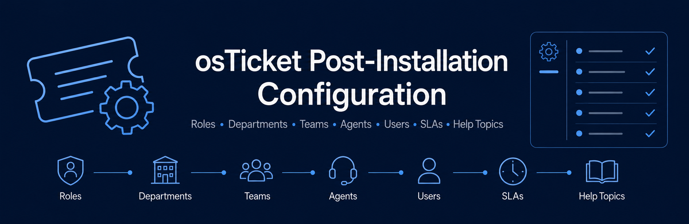

## Project Summary

This project demonstrates the post-installation configuration of the osTicket help desk system. After deploying osTicket, I configured roles, departments, teams, agents, users, SLA plans, and help topics to prepare the platform for realistic help desk operations.

The purpose of this project was to gain hands-on experience with help desk administration, user access, ticket visibility, support team organization, service level agreements, and ticket categorization. This lab helped show how a ticketing system is configured after installation so it can be used by both support staff and end users.

## Related osTicket Projects

- [osTicket: Prerequisites and Installation](https://github.com/CameronJohnson-IT/osticket-prereqs)
- [osTicket: Post-Installation Configuration](https://github.com/CameronJohnson-IT/post-install-config)
- [osTicket: Ticket Lifecycle Examples](https://github.com/CameronJohnson-IT/ticket-lifecycle)

## Technologies Used

- osTicket
- Microsoft Azure
- Azure Virtual Machines
- Remote Desktop Protocol
- Internet Information Services (IIS)
- PHP
- MySQL
- Web-based administration panel

## Languages / Components Used

- PHP
- SQL / MySQL
- IIS web server components
- osTicket web application
- Web-based configuration interface

## Environments Used

- Microsoft Azure
- Windows 10 Virtual Machine
- osTicket Admin Panel
- osTicket Agent Panel
- osTicket End-User Portal

## Configuration Objectives

- Access the osTicket Admin/Analyst panel
- Understand the difference between the Admin Panel and Agent Panel
- Configure roles for permission grouping
- Configure departments for ticket visibility and routing
- Configure teams for cross-department collaboration
- Adjust user registration settings
- Create agents/workers
- Create users/customers
- Configure SLA plans
- Configure help topics for ticket categorization

## Implementation Steps

### Step 1: Access the osTicket Admin Panel

Logged into the osTicket Admin/Analyst panel using the administrator account created during the installation lab.

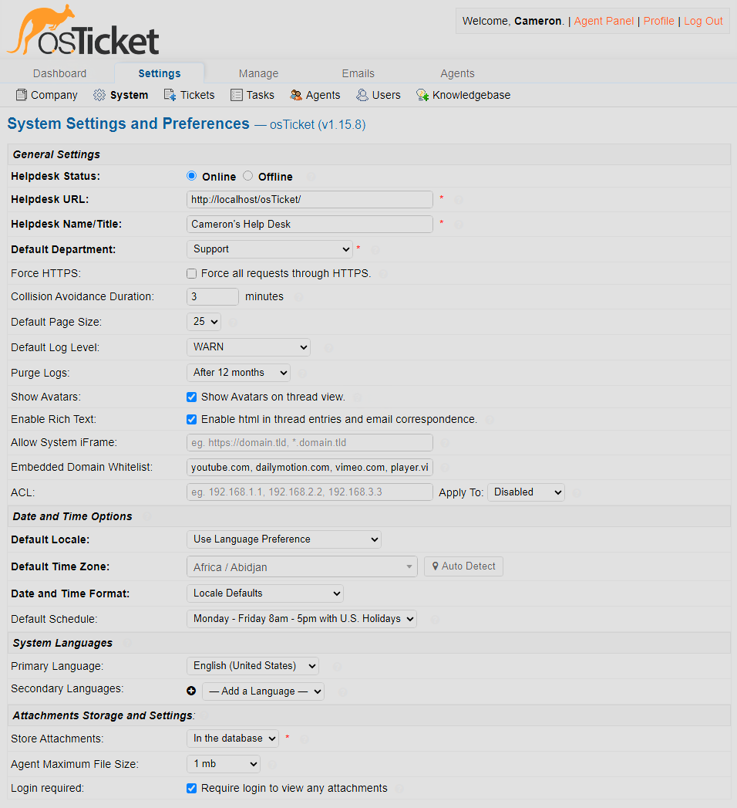

### Step 2: Review Admin Panel vs Agent Panel

Reviewed the difference between the Admin Panel and Agent Panel. The Admin Panel is used to configure the help desk system, while the Agent Panel is used by support staff to manage and respond to tickets.

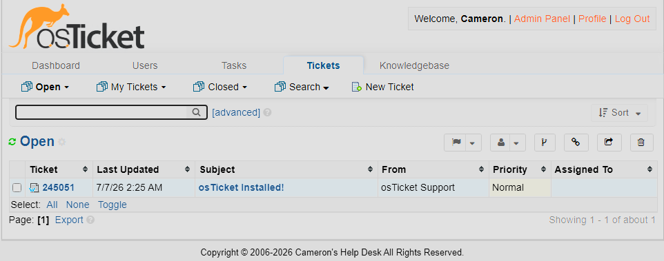

### Step 3: Configure Roles

Configured the `Supreme Admin` role to define administrative permissions for agents. Roles are used to group permissions and control what agents are allowed to access or manage within osTicket.

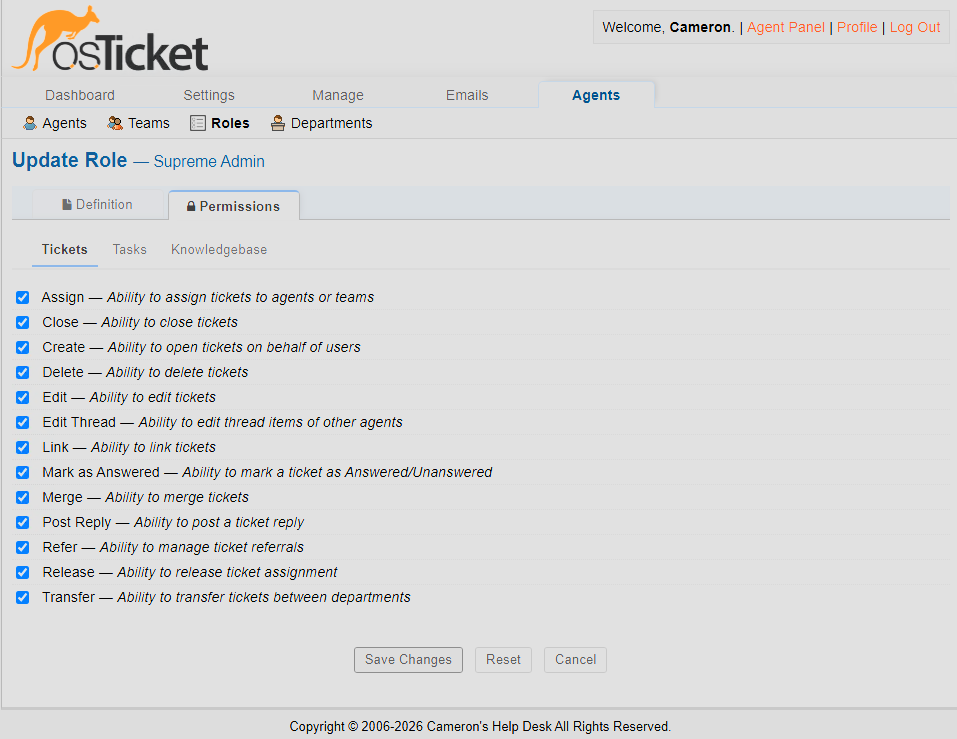

### Step 4: Configure Departments

Created the `SysAdmins` department to organize ticket visibility and routing for system administration-related support requests. Departments help separate support responsibilities and control which agents can view certain tickets.

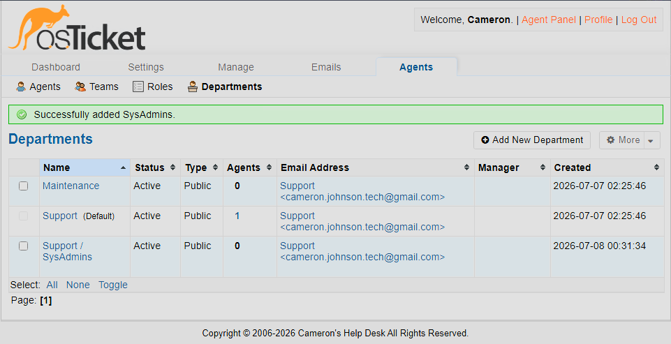

### Step 5: Configure Teams

Created the `Online Banking` team to group agents from different departments for specialized support responsibilities. Teams allow agents to collaborate across departments when certain ticket types require shared ownership.

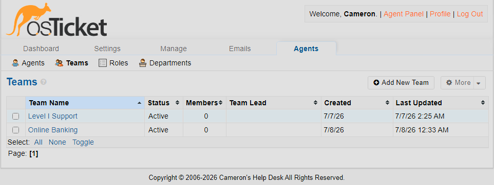

### Step 6: Configure User Registration Settings

Updated user settings to allow anyone to create tickets by unchecking the requirement for users to register before submitting a ticket.

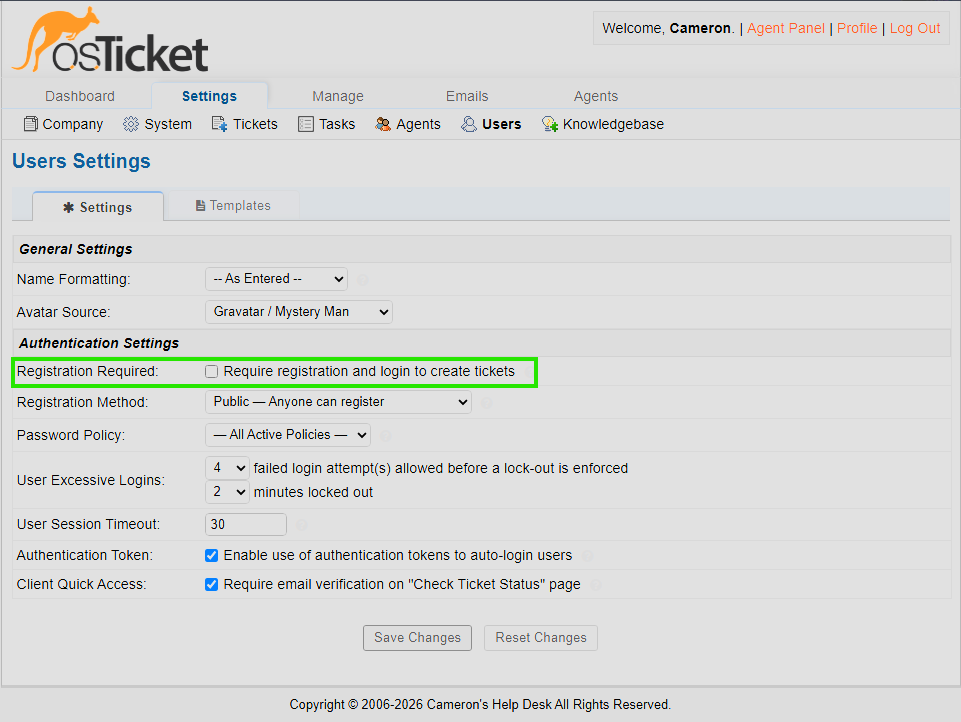

### Step 7: Configure Agents

Created agent accounts for help desk workers. Agents are internal support staff who can access the Agent Panel and work on assigned tickets.

Configured agents:

- Jane: SysAdmins department
- John: Support department

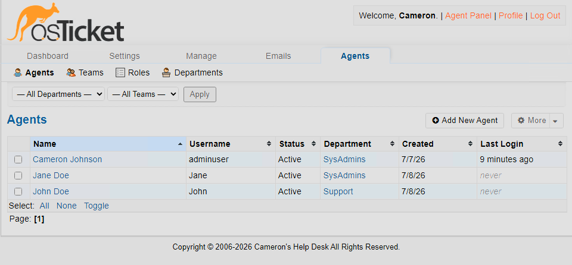

### Step 8: Configure Users

Created customer/end-user accounts to simulate users who would submit support tickets through the end-user portal.

Configured users:

- Karen
- Ken

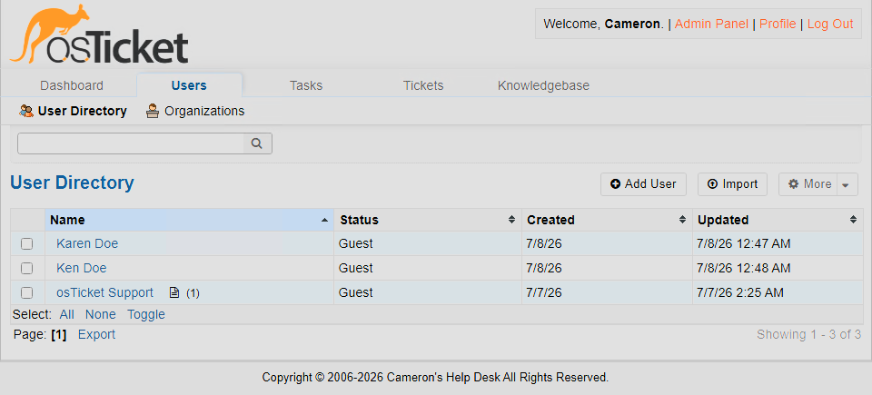

### Step 9: Configure SLA Plans

Configured service level agreement plans to define ticket response expectations. SLA plans help prioritize tickets and establish how quickly different types of issues should be addressed.

Configured SLA plans:

- Sev-A: 1 hour grace period, 24/7 schedule
- Sev-B: 4 hour grace period, 24/7 schedule
- Sev-C: 8 hour grace period, business hours schedule

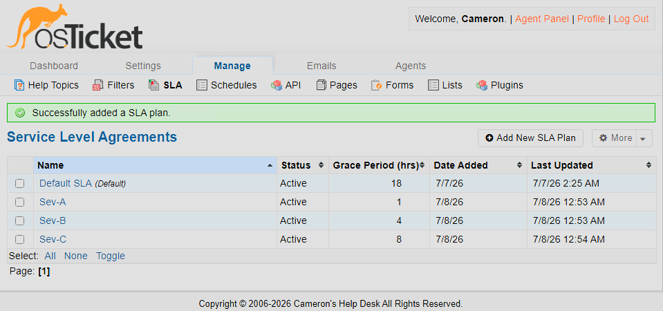

### Step 10: Configure Help Topics

Configured help topics to categorize incoming support requests. Help topics allow users to choose the type of issue they are submitting and help route tickets more effectively.

Configured help topics:

- Business Critical Outage
- Personal Computer Issues
- Equipment Request
- Password Reset
- Other

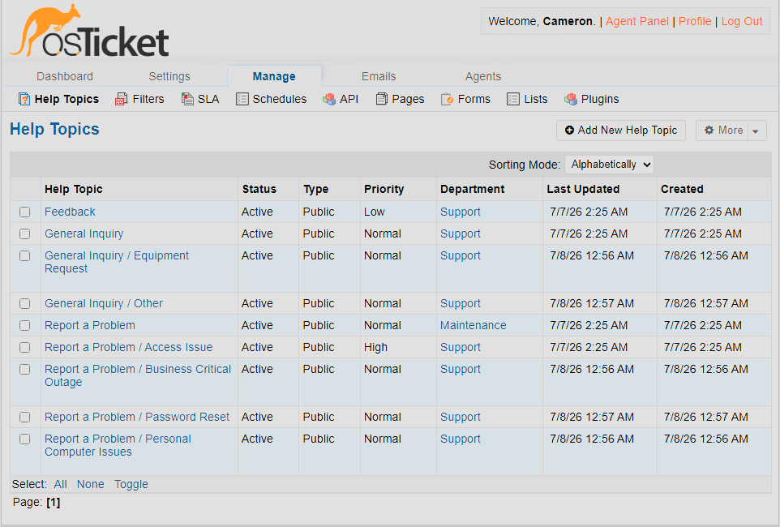

## Demonstration

This project demonstrates how osTicket can be configured after installation to support a realistic help desk workflow. The configuration included administrative roles, departments, support teams, agents, end users, SLA plans, and help topics.

By the end of the lab, the help desk system was prepared to route tickets to the correct departments, assign support responsibilities to agents and teams, apply service level expectations, and organize incoming user requests by topic.

## Skills Demonstrated

- Help desk system administration
- Role-based access control
- Department and team configuration
- Agent and user account management
- Ticket visibility and routing
- SLA configuration
- Help topic configuration
- Technical documentation
- Web-based application administration

## Key Takeaways

This project helped me understand how a help desk platform is configured after installation. I learned how roles, departments, teams, agents, users, SLA plans, and help topics work together to support organized ticket management and realistic help desk operations.

It also reinforced the importance of configuring access, routing, and support workflows before a ticketing system is used in a real environment.
